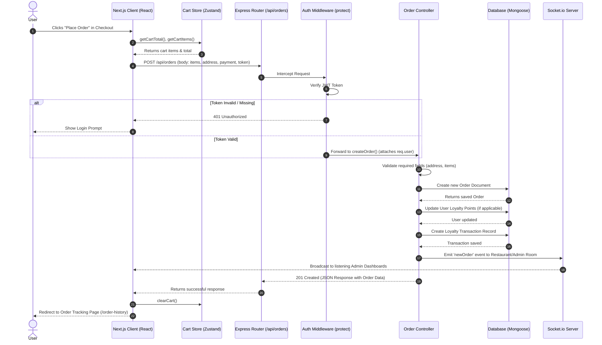

# FlavorStack Sequence Diagrams

Below is a sequence diagram illustrating one of the most critical flows in the application: **The Order Placement (Checkout) Process**. It demonstrates how the Next.js Frontend, Express.js Backend, and MongoDB interact in sync.

## 1. Order Placement Sequence

This diagram tracks the journey of an order from the moment the user clicks "Place Order" to the final database save and real-time notification.

### Breakdown of Steps:
1. **Initiation**: The user finalizes their cart and submits the checkout form.
2. **Local State Read**: The React component pulls the necessary data (cart items, total price) from the local Zustand store.
3. **API Request**: The Next.js frontend sends an Axios `POST` request to the backend.
4. **Authentication**: The Express router intercepts the request with the `protect` middleware to ensure the user's JWT is valid.
5. **Validation**: The `orderController` checks that all necessary fields (like the delivery address) are present.
6. **Database Operations**: The controller writes the new Order to MongoDB, updates the user's loyalty points, and records the loyalty transaction.
7. **Real-time Notification**: (If configured) the server uses Socket.io to alert the restaurant that a new order has arrived.
8. **Response & Cleanup**: The backend responds with success. The frontend clears the user's local cart via Zustand and redirects them to track their order.
