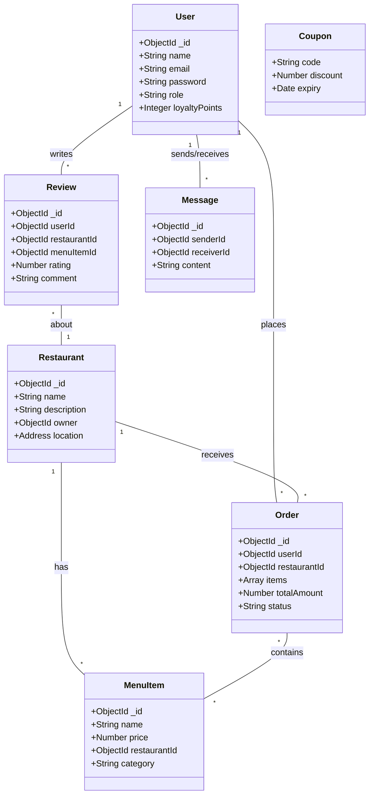

# FlavorStack System Architecture & Overview

This document provides a comprehensive overview of the `food_app_client_and_server` (FlavorStack) project, including the architecture plan, class diagrams, component explanations, tech stack, and how the entire system works in sync.

---

## 1. Architecture Plan

FlavorStack follows a standard, decoupled Client-Server architecture utilizing a modern stack.

```mermaid
graph LR
    A[Next.js Client] <-->|REST API (Axios / React Query)| B(Express.js API Server)
    A <-->|WebSockets (Socket.io)| B
    B <-->|Mongoose / Queries| C[(MongoDB)]
    B <--> D[Cloudinary - Images]
    B <--> E[Stripe - Payments]
    B <--> F[Mailtrap / Email]
```

### **Frontend (Next.js)**
*   Acts as the User Interface, rendering on the client and potentially utilizing Next.js server-side rendering (SSR) or static site generation (SSG) where appropriate.
*   Handles routing using the App Router (`app/` directory).
*   Manages local application state (e.g., Cart, User Session) globally via **Zustand**.
*   Manages server state and data fetching/caching using **React Query**.
*   Connects to Socket.io for real-time updates (Chat, Order Tracking).

### **Backend (Express.js)**
*   Serves as a stateless REST API layer built with Node.js and TypeScript.
*   Handles business logic: User Authentication (JWT), Order Processing, Recommendations, and more.
*   Acts as a bridge between the frontend and the database or third-party APIs.
*   Exposes WebSockets for real-time features.

### **Database (MongoDB)**
*   NoSQL Database to store non-relational, flexible document data.
*   Interacted with via Mongoose Object Data Modeling (ODM) to provide schema validation.

---

## 2. Class Diagram (Data Models)

The following diagram outlines the primary data entities and their relationships managed by the backend Mongoose models.



---

## 3. Frontend Components Explained

The `my-app/components` folder contains the building blocks of the UI. Here is a breakdown of their responsibilities:

### Core / Layout
*   **`Layout_comp.tsx` & `ClientInit.tsx`**: Wrappers for initializing global context, providers (React Query, Zustand), and core layout structure.
*   **`Loading.tsx`**: Reusable loading spinner/skeleton component.

### Discovery & Navigation
*   **`HomePage.tsx`**: The main landing page, aggregating featured restaurants, recipes, and categories.
*   **`DynamicSearch.tsx`**: Provides search functionality to find restaurants, dishes, or recipes quickly.
*   **`RestaurantList.tsx` & `RestaurantDetail.tsx`**: Displays a grid/list of available restaurants and the detailed view of a specific restaurant (including its menu).
*   **`MenuList.tsx`**: Renders the individual menu items for a selected restaurant.

### Cart & Checkout
*   **`CartDrawer.tsx` & `CartPage.tsx`**: Displays items the user has added to their cart, allowing quantity adjustments.
*   **`Checkout.tsx`**: Handles the final purchase flow, collecting addresses and initializing the Stripe payment gateway.
*   **`OrderProcessing.tsx` & `OrderTracking.tsx`**: Components shown post-checkout to track the status of an order in real-time.
*   **`OrderHistory.tsx`**: Displays past user orders.

### User Interaction & Engagement
*   **`ChatSupport.tsx`**: Real-time chat interface connecting to the Socket.io backend.
*   **`StarRating.tsx`, `FeedbackForm.tsx`, `FeedbackList.tsx`, `MyReviews.tsx`**: System for viewing, leaving, and managing ratings and reviews.
*   **`FavouriteButton.tsx` & `Favorites.tsx`**: Allows users to save specific items or restaurants for later.
*   **`LoyaltyRewards.tsx`**: Displays user loyalty points and available coupons.
*   **`RecipeList.tsx` & `RecipeSuggestion.tsx`**: Additional content allowing users to view recipes.

### Profile Management
*   **`ProfileCard.tsx` & `AddressBook.tsx`**: Manage user account details and delivery addresses.

---

## 4. Tech Stack

### **Frontend**
*   **Next.js (App Router)**: React framework for building the UI and routing.
*   **React (v18)**: Core UI library.
*   **Tailwind CSS & Radix UI**: Styling framework and accessible headless UI components.
*   **Framer Motion & GSAP**: For dynamic animations.
*   **Zustand**: Lightweight global state management.
*   **React Query (TanStack Query) & Axios**: Data fetching, caching, and API requests.
*   **React Hook Form & Zod**: Form handling and schema validation.
*   **Socket.io-client**: Real-time bidirectional event-based communication.

### **Backend**
*   **Node.js & Express.js**: Server runtime and API framework.
*   **TypeScript**: Static typing for better developer experience and code safety.
*   **MongoDB & Mongoose**: Database and object modeling.
*   **JSON Web Tokens (JWT) & bcryptjs**: For secure authentication and password hashing.
*   **Socket.io**: Real-time WebSocket server.
*   **Stripe**: Payment processing API.
*   **Cloudinary & Multer**: Cloud file storage for images and middleware for handling file uploads.
*   **Nodemailer & Mailtrap**: Email service integration.

---

## 5. How It Works in Sync (The Workflow)

1.  **Initial Load & State**: When a user opens the app, Next.js serves the initial UI. `ClientInit` sets up the React Query client and loads any persisted Zustand state (e.g., cart items from local storage, JWT token).
2.  **Browsing**: As the user navigates, React Query fetches data (e.g., `GET /api/restaurants`) via Axios. If the data is already in the cache, it loads instantly; otherwise, a loading state (`Loading.tsx`) is shown while fetching.
3.  **Authentication**: If the user logs in, the backend verifies credentials and returns a JWT. The frontend stores this token and attaches it to subsequent Axios requests via interceptors to access protected routes.
4.  **Cart Management**: The user adds items via `MenuList.tsx`. This updates the local Zustand store (represented in `CartDrawer.tsx`). No backend calls are made until checkout, keeping the app fast.
5.  **Checkout & Payment**:
    *   The user initiates checkout. The frontend sends cart data to `POST /api/orders`.
    *   The backend validates the items, calculates the total, and creates an intent with Stripe.
    *   Stripe processes the payment. Upon success, the backend updates the Order status to 'Paid' and saves it to MongoDB.
6.  **Real-time Updates**:
    *   Once an order is placed, `OrderTracking.tsx` connects to the Socket.io server.
    *   When the restaurant updates the order status (e.g., "Preparing", "Out for Delivery"), the Express server emits a Socket event.
    *   The client receives the event and updates the UI instantly without needing to refresh.
    *   Similarly, `ChatSupport.tsx` uses WebSockets for instant messaging between the user and support/restaurant.
7.  **Images**: When a user uploads a profile picture or a restaurant adds a menu item, `Multer` catches the file, and it is uploaded directly to `Cloudinary`. The Cloudinary URL is then saved in MongoDB.
