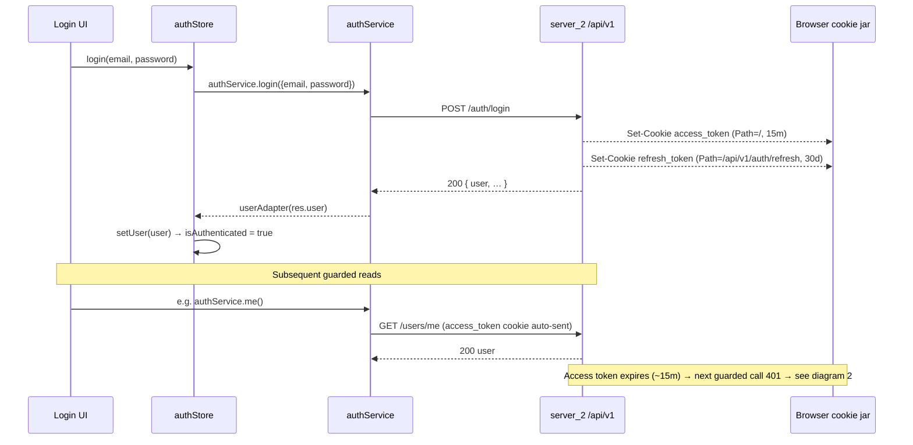
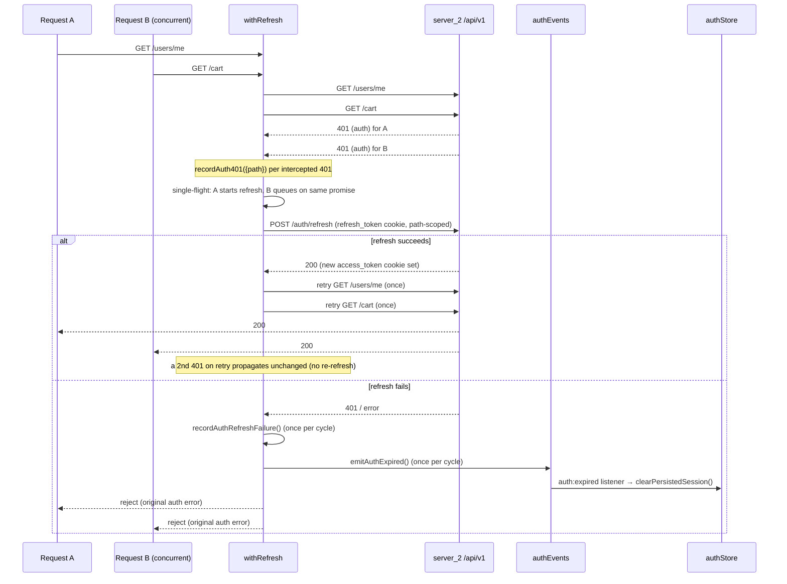
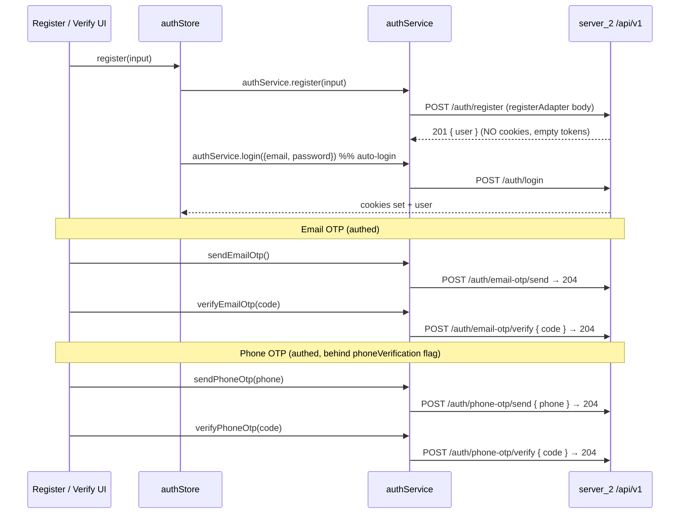
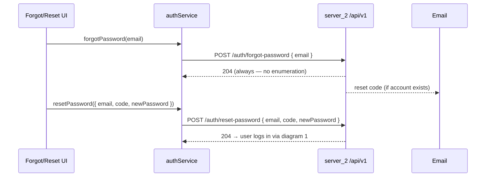

# Auth / OTP / Refresh Flows

> **Source of truth:** `lib/api/services/auth.ts`, `lib/api/client/withRefresh.ts`,
> `lib/api/client/authEvents.ts`, `store/authStore.ts`. The diagrams below are
> function-level accurate to those files; regenerate when they change.

**Cookie model (frozen `server_2`, accommodated not changed):**

- `access_token` — `Path=/`, ~15-min TTL, sent on every `/api/v1/*` request.
- `refresh_token` — **path-scoped** to `/api/v1/auth/refresh`, ~30-day TTL, so
  it is only ever attached to the refresh call.
- Both cookies are `HttpOnly; SameSite=Lax` and `Secure` only when
  `NODE_ENV=production`. Lax + same-origin is why prod must serve FE + API under
  one origin (see `DEPLOYMENT.md`).
- The client base URL is `/api/v1`; `withRefresh` uses the **relative** path
  `/auth/refresh`, i.e. `/api/v1/auth/refresh` — exactly the refresh cookie's
  scope.

---

## 1. Login + cookie set + refresh lifecycle

## 2. Single-flight 401 → refresh → retry → `auth:expired`

`createRefreshingRequest` (`withRefresh.ts`) wraps the transport. A 401 of
`category === "auth"` triggers **one shared** refresh; concurrent 401s queue on
the same promise and each retries **once**. `/auth/login` and `/auth/refresh`
are **bypassed** (a 401 there is a real credential failure, not an expired
session).

## 3. Register + email / phone OTP verification

Register returns **201 with no cookies**; `authStore.register` auto-logs in
immediately. OTP send/verify are **authed** (server targets the current session);
phone send carries the phone number, both verifies carry `{ code }`.

## 4. Forgot / reset password

`forgot-password` **always** returns 204 (no user enumeration); the emailed
code is later exchanged with the new password.

